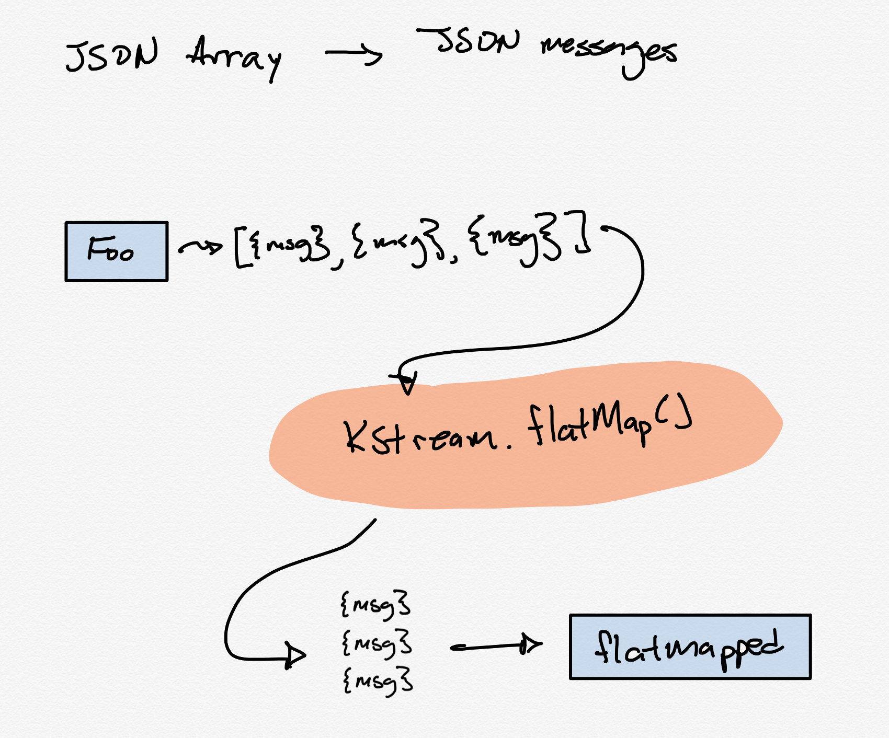

# Flat map exmaple

This project shows how to write a KStreams application to create new records from a single message using flatmap

## Diagram


## Start Confluent Platform

```bash
make cluster
```

## IntelliJ

Debug the App.java class.

## Send messages to Kafka

```bash
kafka-console-producer --broker-list localhost:9092 --topic foo
> [{"a": "asdf" },{"a": "qwer"}]
> [{"a": "asdf" },{"a": "qwer"}]

```

## Confluent Control Center

Go to http://localhost:9021 under topics and view the `foo` topic. You should see these messages broken out into multple records.
